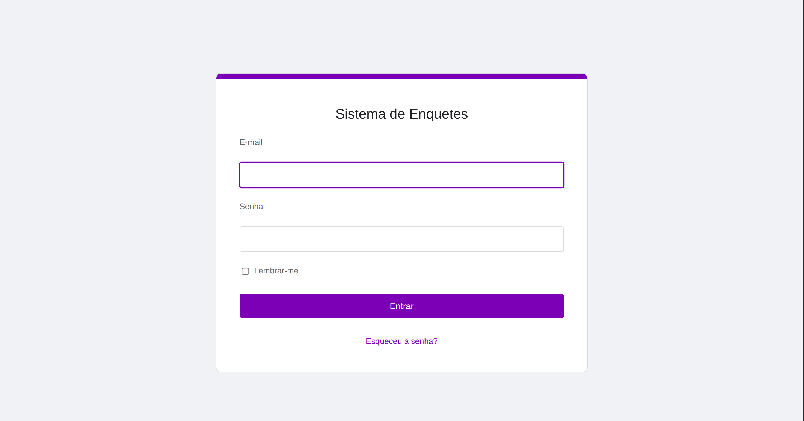
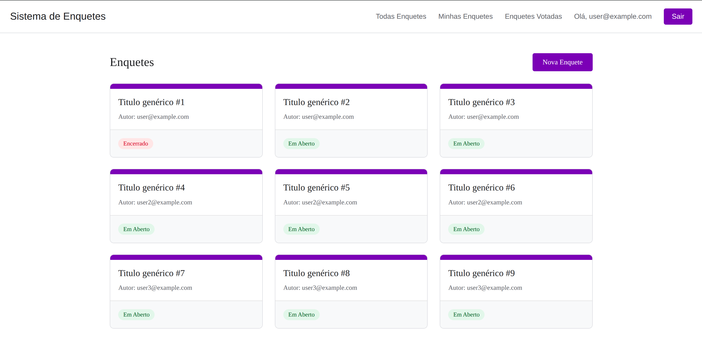
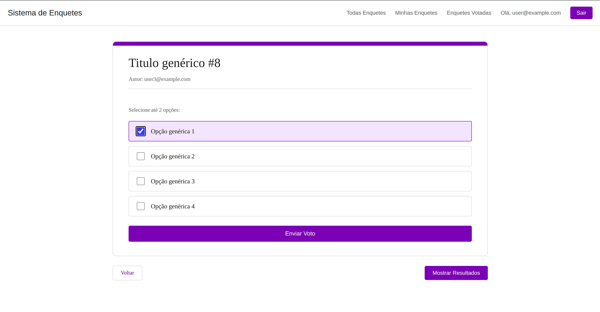
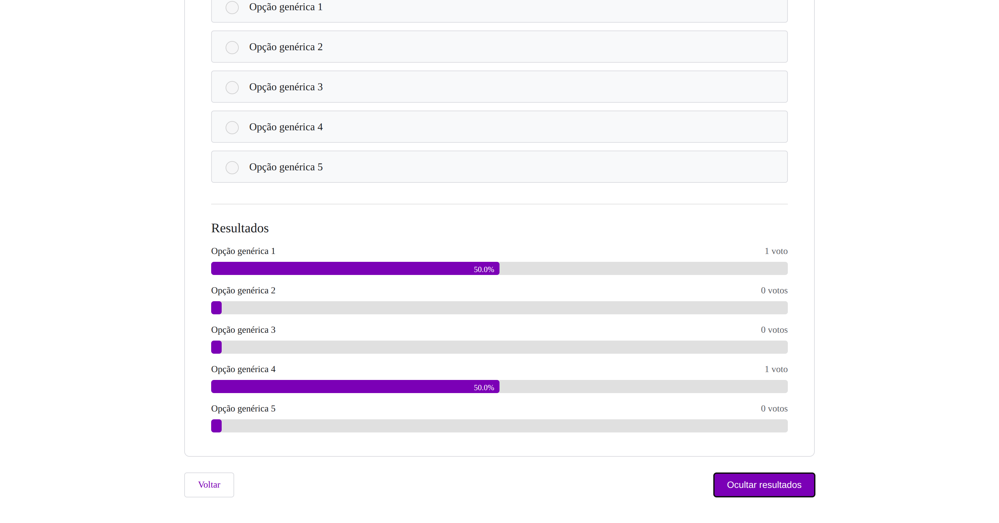
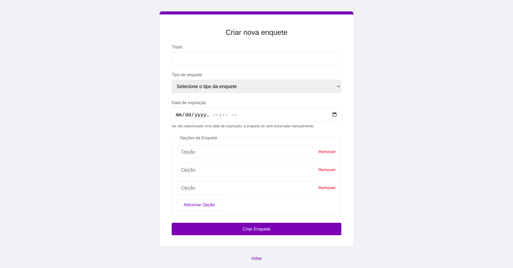

# Sistema de Enquetes

## 🔎 Objetivo do Projeto

O **sistema de enquetes** foi desenvolvido para o desafio de seleção de estagiário na Dunnas Tecnologia, tem como objetivo disponibilizar uma plataforma em que é possível realizar enquetes de única ou multipla escolha e obter de maneira prática uma votação a uma determinada questão.

## 🔧 Processo de desenvolvimento

Inicialmente foi realizado a criação dos tipos de usuários que acessam o sistema, o usuário comum e o administrador, onde o primeiro possui acesso a realizar enquetes, votar e visualizar outras enquetes existentes, já o segundo possui acesso somente a visualizar as enquetes e a criar/excluir usuários (os usuários comuns e o administrador). Posteriormente foi construído o sistema de enquetes que é possível selecionar uma questão, o tipo da enquete, uma data para finalizar, a quantidade de votos máximo (para enquete do tipo múltipla escolha) e as opções de voto, também é possível após abertura visualizar os votos e encerrar a enquete. Para finalizar foi feito a estilização do sistema, com estilo sendo baseado no google forms com foco na usabilidade do usuário. Foi desenvolvido utilizando da **arquitetura MVC**.

## 🧩 Principais Funcionalidades

### 🔹 Usuário comum:
* Criar, encerrar e votar (nas que não são de sua autoria) em enquetes.
* Visualizar todas as enquetes, as votadas e de sua autoria.
* Para toda e qualquer enquete é possível visualizar os resultados (caso tenha tido votos).

### 🔹 Administrador:
* Criar novos usuários de ambos os tipos (comum e administrador), não possui auto-registro.
* Excluir usuários, e em caso desse usuário possuir alguma enquete elas são automaticamente fechadas e mantendo informação de quem a criou.
* Visualizar os usuários e as enquetes com seus resultados.

### 🔹 Enquetes:
* Possuem como dados de criação, título da enquete, tipo como única e múltipla escolha, data de expiração para encerramento da enquete e se não for selecionado uma data só é encerrado quando o autor desejar, quantidade de opções de escolha máxima (para múltipla escolha) e as opções de voto.
* Após criada é possível visualizar o status, como aberta ou encerrada, os resultados, autor e data de encerramento (se possuir).

## ⚡ Tecnologias Utilizadas

- **Linguagem:** Ruby - 3.4.5
- **Framework:** Ruby on Rails - 8.0.2.1
- **Banco de dados:** PostgreSQL - 16.9
- **Autenticação:** Devise - 4.9.4
- **Gerenciamento de variáveis de ambiente:** dotenv-rails - 3.1.8

## 📷 Imagens da aplicação

Diagrama relacionado do banco de dados:

-imagem ficticia-


Algumas imagens da aplicação em funcionamento:

| Funcionalidade | Imagem |
|----------------|--------|
| Tela de Login |  |
| Tela inicial |  |
| Tela de enquete |  |
| Resultados |  |
| Criar nova enquete |  |


## 🛠️ Instruções de Setup 

```bash

git clone https://github.com/ratelp/sistema-enquetes.git

cd sistema-enquetes

bundle install

# Após instalação do sistema é necessário criar um arquivo '.env' na raiz do projeto seguindo exemplo listado em '.env.example'

rails db:create
rails db:migrate
rails db:seed

rails s

```

### 🔐 Credenciais iniciais

- **Administrador:**
  - **Email:** admin@example.com
  - **Senha:** password123

- **Usuário comum:**
  - **Email:** user@example.com
  - **Senha:** password123

- **Usuário comum:**
  - **Email:** user2@example.com
  - **Senha:** password123

- **Usuário comum:**
  - **Email:** user3@example.com
  - **Senha:** password123

## Limitações e melhorias

* Para um sistema escalável com novos usuários de forma crescente o ideal seria que o sistema possuísse auto-registro para usuários comuns.
* Colocar diferentes temas para o usuário escolher, como o clássico tema escuro.
* Habilitar exclusão/edição de enquetes para o caso de cliente tiver cometido algum erro durante criação poder criar a enquete desejada sem necessidade da criação de uma nova mantendo a antiga obsoleta em sistema. Para evitar alteração após votação ocorrer, uma possibilidade seria excluir todos os votos que tivessem sido feitos ou limitar a somente ser possível essa alteração antes de ocorrer algum voto.